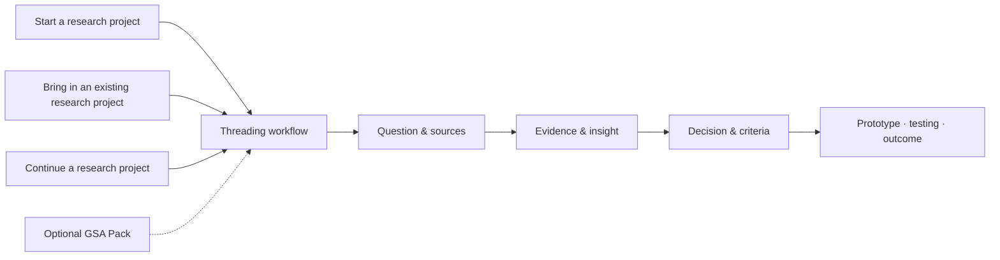

# Threading

[中文版 →](README.md)

> **Threading is an Agent-native, evidence-led project workflow for Research and Design.**
> It connects questions, research, decisions, prototypes and testing into a working
> chain that can keep a Research and Design project moving.

Threading runs directly in Codex and Claude Code. The repository is the complete
project workflow; the included Threading Skill makes that workflow callable from
other Agent workspaces.

## At a glance



| Layer | Role |
| --- | --- |
| Research project | The user's own Research and Design work: questions, research, design, prototypes, testing and outcomes |
| Managed Workspace | Stores the research project's context, evidence, decisions, iteration records and outputs |
| Threading core | Provides the workflow, rules, methods, templates, Dashboard and local project space |

## What you can do with Threading

Here, a “research project” means the user's own Research and Design project,
such as a design research, service design or product design project.

- **Move a complete Research and Design project forward:** begin with a brief, research question or existing progress, then continue through design development, prototyping, testing and outcome.
- **Clarify research and design directions:** compare research questions, design opportunities or concept directions, showing the evidence, risks and open questions behind each one.
- **Turn research material into usable insights:** distinguish evidence, interpretation and insight across interviews, observations, literature, PDFs, images and project records, then form Actionable Insights without presenting assumptions as findings.
- **Move from insight to design:** translate Insights into design opportunities, design criteria, concepts, prototype briefs and testable questions.
- **Find gaps in design progress:** identify broken links between evidence and insight, criteria and concepts, or prototypes and testing, including unsupported claims and assumptions.
- **Design and review prototype testing and iteration:** define what a prototype can test, separate participant response, researcher interpretation and design decision, then shape the next iteration.
- **Review project communication and evidence:** check whether a Project Narrative, presentation, project document or reflection clearly connects its argument, evidence, decisions, limitations and design progress.
- **Select and apply Research and Design methods:** choose methods for a specific research question and make their inputs, outputs, limitations and next verification step explicit.
- **Keep a traceable project memory:** let later prototypes, tests, presentations and documents return to earlier evidence, decisions and changes of direction without repeatedly reconstructing the whole project.

## Get started

### 1. Clone

```bash
git clone https://github.com/51younglowkey/Threading.git
cd Threading
```

### 2. Open Threading

Open the cloned `Threading` folder as a workspace in Codex or Claude Code. On
the first interaction, the Agent automatically registers the Threading Skill at
user level so it can also be called from other workspaces. If the environment
asks for file permission, approve it once.

### 3. Bring in your research project

Threading can start from scratch, join work already in progress, or continue an
existing Managed Workspace:

```text
Help me create a new research project workspace
Help me adopt this existing research project
Continue this research project
```

Research material can stay in Figma, local folders, PDFs or its original
platform. If a project has already developed through ChatGPT, Claude, DeepSeek
or another large language model, provide either a structured project handoff or
a complete Markdown conversation export.

### Update Threading

```bash
python3 90_scripts_tools/threading/update_threading.py
python3 90_scripts_tools/threading/update_threading.py --apply
python3 90_scripts_tools/threading/update_threading.py --apply-workspaces
```

The update uses two review gates: it updates the Core and shows the resulting
Compatibility Plan before preserving project records, adding missing schema
files and writing an Upgrade Report. You can also say `Update Threading and
reconnect my existing projects`.

After updating from v0.2, reopen Threading once. The new Agent instructions will
automatically check whether existing projects need to be reconnected.

## Example

The following is synthetic and does not represent real research findings.

You can say:

```text
Here are my research summary, two design directions and one round of prototype
testing notes. Compare the directions and find the missing connections in my
Design Progress.
```

Threading will return an analysis shaped like this:

```text
DESIGN DIRECTION REVIEW

Direction A      [supporting evidence] · [main risk]
Direction B      [supporting evidence] · [main risk]

Progress gaps
1. [an insight has not yet been translated into design criteria]
2. [a concept decision is not traceable to research evidence]
3. [the prototype test checks usability but not the main project claim]

Revision focus   [the most important connection to strengthen next]
```

The actual analysis cites only the research material the user has allowed
Threading to inspect and distinguishes existing evidence, analytical judgement
and work still requiring verification.

## Optional extension: GSA Pack

The GSA Pack adds two capabilities for Design Innovation-related study:

- **Academic methods:** Semester taught methods, Provotyping and Reflection Document guidance-video analysis.
- **Criteria-based review:** review presentations, Reflection Documents and other project documents against Stage 3 ILOs, criteria, rubric and evidence requirements, then identify improvement priorities.

```text
Load the GSA Pack
Use Design Innovation methods to analyse this research project
Use the GSA Pack to review my presentation
Check whether this Reflection Document addresses the relevant ILOs
```

The GSA Pack is an independent academic aid. It does not represent an official
position of Glasgow School of Art and does not replace current official
assessment sources or final assessment.

## Project boundary

The public repository provides only the reusable core. Personal research
material, participant data, private correspondence, complete AI conversations
and restricted course originals remain in the user's own local space. Threading
inspects only sources the user has authorised and keeps project knowledge in the
user's own Managed Workspace.

## Continue reading

- [Quickstart](docs/QUICKSTART.md) — install and start Threading.
- [Agent onboarding](docs/AGENT_ONBOARDING.md) — bring a research project into Threading.
- [Text Dashboard](DASHBOARD.md) — view the research project's current working state.
- [Capabilities](docs/CAPABILITIES.md) — browse the full natural-language capability guide.
- [Chat reconciliation](docs/CHAT_RECONCILIATION.md) — handle project conversations and full exports from large language models.
- [Compatibility upgrade](docs/COMPATIBILITY_UPGRADE.md) — update Threading and reconnect existing project records.
- [GSA Pack](packs/gsa/README.md) — explore Design Innovation methods and criteria-based review.

Threading is an independent project. Code uses the MIT License; original
documentation, templates and examples use CC BY 4.0.
