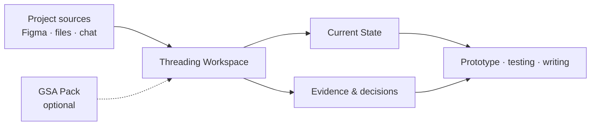

# Threading

[中文版 →](README.md)

> Threading is a local Codex Agent workspace for research, design and academic
> projects. It turns material spread across Figma, local folders and chat
> exports into a working chain: `Sources → Evidence → Decisions → Prototypes →
> Testing → Writing`.

Threading helps an Agent understand an existing project quickly while the owner
keeps confirming what is current, what is supported and what should happen next.

## At a glance



| Layer | Role |
| --- | --- |
| Project sources | Original Figma, files, PDFs, images and chat records remain user-controlled |
| Managed Workspace | Stores source pointers, Current State, derived knowledge, evidence, decisions and outputs |
| Threading core | Provides rules, templates, tools, Dashboard and an installable Skill |
| GSA Pack | An optional linked, read-only Design Innovation academic pack |

## Repository surface

```text
core/              reusable rules, templates and skill library
90_scripts_tools/  adoption, update, Dashboard and indexing tools
docs/              onboarding and operating guides
packs/             optional academic packs
projects/          Managed Workspace templates
skills/            installable Agent skill
profiles/          v0.1 migration compatibility
examples/          synthetic example
tests/             automated checks
```

The root keeps Agent entry points, version information, licences and the two
README files. Internal rules and templates are grouped under `core/` so the
GitHub landing page stays short and legible.

## What Threading helps with

- adopt an existing project whose material is spread across several places;
- propose a current Figma candidate for owner confirmation;
- reconcile imported ChatGPT Markdown while preserving the raw archive;
- connect evidence, interpretation, decisions, prototypes and testing;
- give each school project its own local Managed Workspace;
- keep writing, prototyping and next actions connected to project knowledge.

## Start here

First use:

```bash
git clone https://github.com/51younglowkey/Threading.git
cd Threading
python3 90_scripts_tools/threading/install_skill.py
```

Then open the repository in Codex Agent and say: `adopt this existing project`.
Provide the project title, material locations and the sources you want to use;
original material stays in its source location.

Update to the latest GitHub version:

```bash
git pull --ff-only origin main
```

For a safe update check, run:

```bash
python3 90_scripts_tools/threading/update_threading.py
```

Useful everyday prompts include `Dashboard`, `reconcile chat archive`, `map Figma`,
`load GSA Pack` and `Update Threading`.

See [QUICKSTART](docs/QUICKSTART.md) and
[EXISTING_USER_UPGRADE](docs/EXISTING_USER_UPGRADE.md) for onboarding and legacy
profile migration.

## GSA Pack

The GSA Pack is an independent academic pack for Design Innovation-related work.
It includes:

- Semester taught-method catalogues;
- Provotyping;
- Reflection Document / guidance-video analysis;
- Stage 3 criteria, rubric and ILO guidance.

It uses linked, read-only activation and follows the Threading core version. Project
analysis is written to the user's Managed Workspace. The pack carries no official
endorsement from Glasgow School of Art, and the public repository does not bundle
course PDFs, assessment forms, guidance videos or student examples.

## Project boundary

The public repository provides the reusable core. Personal project material,
participant data, private correspondence and restricted course originals remain in
the user's controlled local space. Derived project knowledge under `projects/local/`
stays outside the public repository. Evidence, claims and decisions retain their
source and confirmation status.

## Continue reading

- [Text Dashboard](DASHBOARD.md)
- [Agent onboarding](docs/AGENT_ONBOARDING.md)
- [Capabilities](docs/CAPABILITIES.md)
- [Figma evolution](docs/FIGMA_EVOLUTION.md)
- [Chat reconciliation](docs/CHAT_RECONCILIATION.md)
- [Provenance and licensing](docs/PROVENANCE_AND_LICENSING.md)

Threading is an independent project. The GSA Pack is an independent academic
context and does not represent an official GSA position. Code uses the MIT License;
original documentation, templates and examples use CC BY 4.0.
