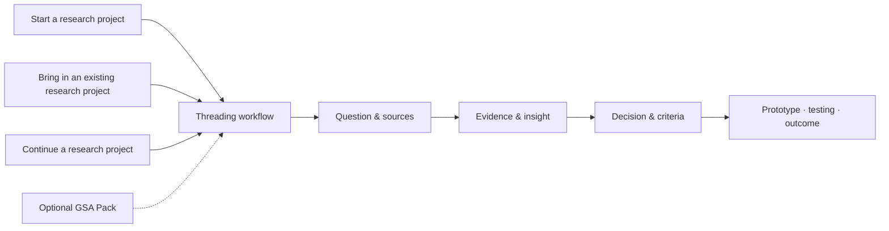

# Threading

[English version →](README.en.md)

> **Threading 是一个面向 Research and Design 的 Agent-native、evidence-led 项目工作流。**
> 它帮助研究与设计项目把问题、研究、决策、原型和测试连接起来，形成一条可以持续推进的工作链。

Threading 可以直接在 Codex 和 Claude Code 中使用。
Threading 本体是完整的项目工作流；随仓库提供的 Threading Skill 是它在不同 Agent workspace 中的调用入口。

## 一眼看懂



| 层级 | 作用 |
| --- | --- |
| Research project | 用户自己的 Research and Design 工作：问题、研究、设计、原型、测试和成果 |
| Managed Workspace | 保存研究项目的上下文、证据、决策、迭代记录和 outputs |
| Threading core | 提供工作流、规则、方法、模板、Dashboard 和本地项目空间 |

## 你可以用 Threading 做什么

下面的“研究项目”指用户自己的 Research and Design project，例如 design research、service design 或 product design project。

- **推进完整的研究与设计项目**：从 brief、research question 或已有进度出发，持续推进完整的 Research and Design Project，直到 design development、prototype、testing 和 outcome。
- **梳理研究与设计方向**：比较不同 Research and Design Directions，例如 research questions、design opportunities 或 concept directions，说明各自的依据、风险和仍需验证的部分。
- **把研究材料转化为可用洞察**：从 Research Materials——访谈、观察、文献、PDF、图片或项目记录——中区分 evidence、interpretation 和 insight，并形成 Actionable Insights，避免把推测当成发现。
- **把洞察推进为设计**：将 Insights 转化为 design opportunity、design criteria、concept、prototype brief 和可检验的问题。
- **检查设计进展中的缺口**：识别 Design Progress Gaps，找出 evidence 与 insight、criteria 与 concept、prototype 与 testing 之间断开的环节，以及尚未被支持的 claims 和 assumptions。
- **设计并审查原型测试与迭代**：规划 Prototype Testing and Iteration，明确 prototype 能验证什么，区分 participant response、researcher interpretation 和 design decision，再形成下一轮 iteration。
- **审查项目表达与证据**：检查 Project Narrative、presentation、project document 或 reflection 中的 argument、evidence、decision、limitation 和 design progress 是否清楚对应。
- **选择并应用研究与设计方法**：根据研究问题选择合适的 Research and Design Methods，说明需要的 inputs、能得到的 outputs、局限以及下一步验证方式。
- **保留可追溯的项目记忆**：建立 Traceable Project Memory，让后续的 prototype、testing、presentation 和 document 可以回到早期 evidence、decisions 和方向变化，而不必每次重新解释整个研究项目。

## 开始使用

### 1. Clone

```bash
git clone https://github.com/51younglowkey/Threading.git
cd Threading
```

### 2. 打开 Threading

在 Codex 或 Claude Code 中，把 Clone 后的 `Threading` 文件夹作为 workspace 打开。
第一次开始对话时，Agent 会读取仓库中的项目指令，并自动把 Threading Skill 注册到用户级 Skill 目录。完成后，它也可以在其他 workspace 中被调用；如果系统要求文件权限，只需批准一次。

### 3. 接入你的研究项目

Threading 可以从头建立、接入已经进行中的研究项目，或继续一个已有的 Managed Workspace：

```text
帮我新建一个研究项目空间
帮我接管这个现有研究项目
继续推进这个研究项目
```

研究材料可以继续留在 Figma、本地文件夹、PDF 或原来的平台中。如果项目曾经在 ChatGPT、Claude、DeepSeek 或其他大语言模型里推进，可以提供一份结构化 project handoff，也可以提供完整的 Markdown 对话导出。

### 更新 Threading

```bash
python3 90_scripts_tools/threading/update_threading.py
python3 90_scripts_tools/threading/update_threading.py --apply
python3 90_scripts_tools/threading/update_threading.py --apply-workspaces
```

更新分两次确认：先更新 Core 并展示 Compatibility Plan，再保留已有记录、补齐新版结构并生成 Upgrade Report。也可以直接说：`升级 Threading，并接续我已有的项目`。

从 `v0.2` 更新后重新打开一次 Threading；新版 Agent 会自动检查已有项目是否需要接续。

## Example

下面是一个合成示意，不代表真实研究结果。

你可以说：

```text
这是我的 research summary、两个 design directions 和一轮 prototype testing notes。
请比较两个方向，并检查我的 Design Progress 还缺少哪些关键连接。
```

Threading 会给出类似这样的分析：

```text
DESIGN DIRECTION REVIEW

Direction A      [supporting evidence] · [main risk]
Direction B      [supporting evidence] · [main risk]

Progress gaps
1. [an insight has not yet been translated into design criteria]
2. [a concept decision is not traceable to research evidence]
3. [the prototype test checks usability but not the main project claim]

Revision focus   [the most important connection to strengthen next]
```

实际分析会引用用户允许 Threading 检查的研究材料，并清楚区分已有证据、分析判断和仍需验证的内容。

## 可选扩展：GSA Pack

GSA Pack 为 Design Innovation 相关学习增加两类附加能力：

- **Academic methods**：Semester taught methods、Provotyping 和 Reflection Document guidance-video analysis。
- **Criteria-based review**：根据 Stage 3 ILOs、criteria、rubric 和 evidence requirements 审查 presentation、Reflection Document 或其他项目文档，并提出 improvement priorities。

```text
加载 GSA Pack
用 Design Innovation 方法分析这个研究项目
用 GSA Pack 审查我的 presentation
检查这个 Reflection Document 是否覆盖相关 ILOs
```

GSA Pack 是独立的学术辅助包，不代表 Glasgow School of Art 的官方立场，也不替代当前官方 assessment source 或最终评估。

## 项目边界

公开仓库只提供 reusable core。个人研究材料、participant data、private correspondence、完整 AI 对话和受限课程原件留在用户自己的本地空间。Threading 只在获得允许后检查指定来源，并把项目知识保存在用户自己的 Managed Workspace 中。

## 继续阅读 / Continue reading

### 中文

- [Quickstart](docs/QUICKSTART.md) — 第一次安装和启动 Threading。
- [Agent onboarding](docs/AGENT_ONBOARDING.md) — 把研究项目接入 Threading。
- [Text Dashboard](DASHBOARD.md) — 查看研究项目当前的工作状态。
- [Capabilities](docs/CAPABILITIES.md) — 查看更完整的自然语言功能入口。
- [Chat reconciliation](docs/CHAT_RECONCILIATION.md) — 处理来自大语言模型的项目对话和完整导出。
- [Compatibility upgrade](docs/COMPATIBILITY_UPGRADE.md) — 更新 Threading 并接续旧版项目记录。
- [GSA Pack](packs/gsa/README.md) — 查看 Design Innovation 方法与 criteria-based review。

### English

- [Quickstart](docs/QUICKSTART.md) — install and start Threading.
- [Agent onboarding](docs/AGENT_ONBOARDING.md) — bring a research project into Threading.
- [Text Dashboard](DASHBOARD.md) — view the research project's current working state.
- [Capabilities](docs/CAPABILITIES.md) — browse the full natural-language capability guide.
- [Chat reconciliation](docs/CHAT_RECONCILIATION.md) — handle project conversations and full exports from large language models.
- [Compatibility upgrade](docs/COMPATIBILITY_UPGRADE.md) — update Threading and reconnect existing project records.
- [GSA Pack](packs/gsa/README.md) — explore Design Innovation methods and criteria-based review.

Threading 是 independent project。代码使用 MIT License；原创文档、模板和示例使用 CC BY 4.0。
