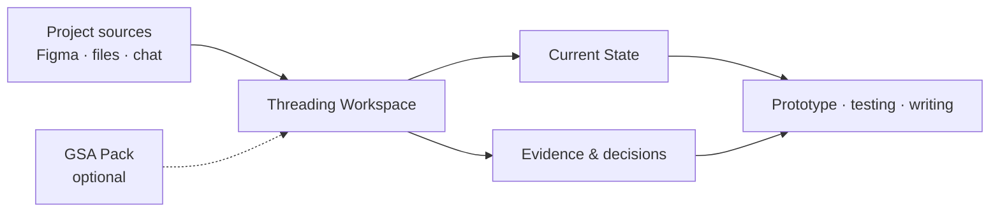

# Threading

[English version →](README.en.md)

> Threading 是一个运行在本地 Codex Agent 上的 research、design 和 academic
> project workspace。它把分散在 Figma、本地文件夹和聊天记录里的项目材料，整理成
> 一条可以持续工作的知识链：`Sources → Evidence → Decisions → Prototypes →
> Testing → Writing`。

Threading 的重点是让 Agent 快速理解一个已有项目，并让项目 owner 持续确认：
现在的方向是什么、哪些内容有证据、下一步要做什么。

## 一眼看懂

| 层级 | 作用 |
| --- | --- |
| Project sources | 原始 Figma、文件、PDF、图片和聊天记录，继续由用户在原位置管理 |
| Managed Workspace | 保存 source pointers、Current State、derived knowledge、evidence、decisions 和 outputs |
| Threading core | 提供规则、模板、工具、Dashboard 和可安装 Skill |
| GSA Pack | 可选的、linked read-only 的 Design Innovation academic pack |

## 你可以用 Threading 做什么

- 接管一个已经存在、但材料分散的项目；
- 从最近的 Figma 版本提出 current candidate，再由你确认 `CURRENT.md`；
- 整理已经导入的 ChatGPT Markdown，保留原始记录并把候选内容分层 review；
- 把 evidence、interpretation、decision、prototype 和 testing 连起来；
- 为每个学校项目建立自己的本地 Managed Workspace；
- 让 Agent 在写作、原型和下一步行动之间持续 callback。

## 开始使用

1. Clone 这个仓库，并在 Codex Agent 中打开它。
2. 对 Agent 说：`帮我接管这个现有项目`。
3. 按引导提供项目名称、材料位置和需要使用的来源；原始材料继续留在原位置。
4. 需要 Design Innovation 学术方法时，说：`加载 GSA Pack`。
5. 日常工作可以直接说：`Dashboard`、`整理已经导入的聊天记录`、`帮我整理 Figma 的演变` 或 `Update Threading`。

完整 onboarding 和旧版本升级说明见 [QUICKSTART](docs/QUICKSTART.md) 与
[EXISTING_USER_UPGRADE](docs/EXISTING_USER_UPGRADE.md)。

## GSA Pack

GSA Pack 是一个独立的 academic pack，面向 Design Innovation 相关工作。它包含：

- Semester taught-method catalogues；
- Provotyping 方法；
- Reflection Document / guidance-video analysis；
- Stage 3 criteria、rubric 和 ILO guidance。

它采用 linked read-only activation，版本随 Threading core 更新；项目内容写入用户自己的
Managed Workspace。Pack 不代表 Glasgow School of Art 的官方 endorsement，公开仓库也不
包含课程 PDF、assessment forms、guidance videos 或 student examples。

## 项目边界

Threading 的公开仓库只提供 reusable core。个人项目资料、participant data、private
correspondence 和受限课程原件留在用户控制的本地空间；`projects/local/` 中的 derived
project knowledge 不进入公开仓库。所有 evidence、claim 和 decision 都需要保留来源与
确认状态。

## 继续阅读

- [Text Dashboard](DASHBOARD.md)
- [Agent onboarding](docs/AGENT_ONBOARDING.md)
- [Capabilities](docs/CAPABILITIES.md)
- [Figma evolution](docs/FIGMA_EVOLUTION.md)
- [Chat reconciliation](docs/CHAT_RECONCILIATION.md)
- [Provenance and licensing](docs/PROVENANCE_AND_LICENSING.md)

Threading 是 independent project；GSA Pack 是 independent academic context，不代表
GSA 官方立场。代码使用 MIT License，原创文档、模板和示例使用 CC BY 4.0。
