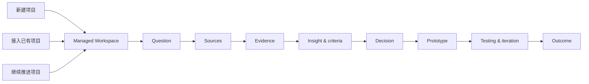
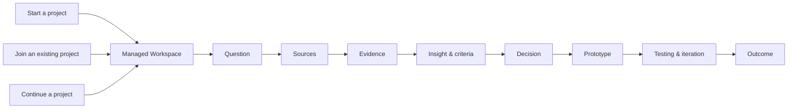

# Threading Agent-native Onboarding

这是一份完整的项目说明书。README 负责让人快速开始；本文件负责说明
Threading 如何从项目早期、项目中段或已有项目进入，并如何持续推进到项目成果。

---

## 中文说明

### 1. Threading 的工作方式

Threading 是一个面向 Research and Design 的 Agent-native、evidence-led 项目工作流。
它把项目从问题和目标推进到可解释、可交付、可继续迭代的成果：



Threading 的完整工作流可以从任意阶段进入。Agent 会先判断项目已经有什么、还缺什么，
再提出下一步；它不会因为材料已经存在，就把旧内容自动当成当前事实。

### 2. 选择项目入口

#### 从零开始

适用于只有一个兴趣、问题、brief 或初步方向的项目。Agent 会帮助你建立：

- project title 和 slug；
- working question；
- intended outcome；
- 当前不确定性；
- 初步 source map 和 evidence plan；
- 一个可以继续工作的 Managed Workspace。

可以直接说：

```text
帮我新建一个项目空间
我想从零开始做一个 service design project
帮我建立一个 evidence-led product design workflow
```

#### 从项目早期开始持续推进

适用于已经有 brief、研究问题或设计目标，但还没有完整方向的项目。Agent 会按顺序
帮助你建立 source、evidence、insight、criteria、decision、prototype 和 testing，
每一步都保留不确定性和下一步验证方式。

可以说：

```text
帮我把这个 brief 变成一个可工作的 research question
帮我建立这个项目的 evidence plan
帮我把当前 insight 转成 design criteria
```

#### 接入已经形成的项目

适用于 Figma、本地文件夹、PDF、图片或 ChatGPT 导出已经存在的项目。Agent 会先登记
source pointers，再请求对明确来源的有限检查权限；原始材料继续留在原位置。

可以说：

```text
帮我接管这个现有项目
帮我把这个项目整理成 Threading Workspace
帮我判断这个项目现在真正工作的方向
```

#### 继续一个已经运行中的项目

适用于已经有 Managed Workspace、Current State 和历史记录的项目。Agent 先读取项目
自己的 `AGENTS.md`、`CURRENT.md`、`packs.md` 和有边界的记录，再帮助你更新当前状态、
证据、决策、原型或下一步行动。

可以说：

```text
继续推进这个项目
Dashboard
帮我找出这个项目现在最重要的下一步
```

### 3. 第一次对话应该确认什么

Agent 一次询问一个问题，按以下顺序建立工作空间：

1. 项目名称和 slug；
2. 项目属于 research、service design、product design、academic project 或其他类型；
3. 当前项目阶段：新建、早期推进、已有材料、测试中、写作中或维护中；
4. 期望的项目成果；
5. 当前最重要的问题或不确定性；
6. 材料存放位置：Figma、本地文件夹、PDF、图片、视频或聊天导出；
7. 是否启用 linked GSA Pack；
8. 是否允许 Agent 检查指定的 source。

除非你明确选择外部路径，项目知识保存在：

```text
projects/local/<slug>/
```

这是被 Git 忽略的本地 Managed Workspace。公共 Threading core、其他项目和原始来源
保持分离。

### 4. 来源登记与检查权限

Threading 先记录 source pointer，再请求 inspection permission。登记一个路径、Figma
文件或聊天导出，不等于 Agent 已经读取它。

来源登记应包含：

- source ID；
- 文件、Figma page/frame 或 archive pointer；
- 来源类型；
- 所属项目和时间范围；
- 允许检查的范围；
- 处理日期；
- 当前状态：`unknown`、`candidate`、`confirmed`、`historical` 或 `superseded`。

原始来源可以继续留在 Figma、Desktop 或聊天平台；Threading 保存的是经过授权、带有
来源指针的 derived knowledge。

### 5. Orientation：先理解，再提升为当前状态

第一次 orientation 要把材料分成几层：

| 状态 | 含义 |
| --- | --- |
| `observed` | Agent 在授权范围内直接看到的内容 |
| `inferred` | 根据多个材料推断出的关系或解释 |
| `candidate` | 可以考虑，但还没有得到 owner 确认的方向 |
| `confirmed` | owner 已确认，可以进入当前工作状态 |
| `unknown` | 目前没有足够材料支持的内容 |
| `superseded` | 曾经有效，但后来被新方向替代的内容 |

Agent 会提出一个 Current State 草案，包括：

- current question；
- current direction；
- current insight / opportunity；
- current working set；
- current prototype 或 draft；
- evidence gaps 和 contradictions；
- 一个具体的 next move。

只有你确认之后，Agent 才能更新项目的 `CURRENT.md`。旧方向进入 decision log 或
iteration log，不会被删除。

### 6. 从证据走向项目成果

Threading 使用下面这条可追溯链路：

```text
source
  → note / observation
  → interpretation
  → insight
  → opportunity
  → criteria
  → decision
  → prototype
  → testing
  → iteration
  → outcome
```

Agent 可以帮助你把材料放到正确层级，但 method、summary 或 model-generated prose 不会
自动成为 empirical evidence。每个 claim 都应该保留来源、确认状态和 limitation。

### 7. Figma、聊天和 PDF 的专用入口

```text
帮我整理 Figma 的演变
帮我提出最近版本的 current candidate
整理已经导入的聊天记录
从聊天记录中提取 candidate insights 和 decisions
帮我分析这些 PDF，并建立本地 index
帮我找出这个项目的 evidence gaps
```

Figma current candidate 需要 owner 确认后，才能写入 `CURRENT.md`。聊天整理会保留
原始 archive，并把候选 insight、decision、rejected direction 和 open question 分开。
PDF / image index 是本地 retrieval aid；找到页面之后仍要检查原始材料。

### 8. 原型、测试、写作与输出

```text
帮我把这个 insight 转成 design opportunity
帮我把 opportunity 转成 design criteria
帮我为这个 prototype 写 testing plan
帮我记录这次 testing 的 response、interpretation 和 design decision
帮我把 evidence chain 变成 document outline
帮我检查这段文字的 claim、evidence 和 limitation
帮我整理一个可以交接的 project summary
```

Testing record 要把 participant response、researcher interpretation 和后续 design
decision 分开。没有 testing record 的 prototype 仍然是 representation，而不是
effectiveness evidence。

### 9. GSA Pack

GSA Pack 是一个可选的、linked read-only 的 Design Innovation academic pack。启用时
直接说：

```text
加载 GSA Pack
```

它提供 Semester methods、Provotyping、Reflection Document / guidance-video analysis、
Stage 3 criteria、rubric 和 ILO guidance。项目分析写入项目自己的 Managed Workspace；
Pack 本体保持只读。对于 consequential assessment wording，要核对当前授权的官方 source。

### 10. Dashboard、更新和迁移

```text
Dashboard
Update Threading
Threading doctor
迁移我的旧 Threading profile
```

公共 core 更新前先运行 check mode。Git 更新只改变 Threading core，不修改
`projects/local/` 中的项目知识。旧 v0.1 profile 迁移时会建立新的 Managed Workspace，
并保留旧 profile 不变。

### 11. 完成标准

一次 onboarding 完成时，Agent 应该能够展示：

- 项目 title、阶段和目标；
- Managed Workspace 路径；
- 已登记的 sources；
- Current State 或待确认的 Current State 草案；
- evidence / decision / iteration 的数量和状态；
- GSA Pack 是否启用；
- 一个有来源支持的 next move；
- 仍然需要人工确认的事项。

模板存在不等于项目已经完成。来源、证据、决定和成果必须保留 provenance、状态和
必要的隐私边界。

---

## English

This is the complete operating guide. The README is the quick start; this document explains
how Threading can start a project, accompany its full lifecycle, join an already-developed
project, or continue an existing Managed Workspace.

### 1. How Threading works

Threading is an Agent-native, evidence-led project workflow for Research and Design. It moves
a project from a question and a goal toward an explainable, deliverable and iterable outcome:



Threading can enter at any stage. The Agent first identifies what is present and what is
missing, then proposes the next move; existing material is not automatically treated as
confirmed current state.

### 2. Choose an entry point

#### Start from scratch

For a project with an interest, question, brief or early direction, Threading helps establish
the title, slug, working question, intended outcome, uncertainty, source map and evidence plan.

Try:

```text
start a new project
help me set up a service design project
help me establish an evidence-led product design workflow
```

#### Start early and continue through the lifecycle

For a brief or design goal that is still forming, Threading builds sources, evidence, insights,
criteria, decisions, prototypes and testing in sequence, keeping uncertainty and the next
verification step visible.

Try:

```text
turn this brief into a working research question
help me make an evidence plan
turn this insight into design criteria
```

#### Join an already-developed project

For a project with Figma, local folders, PDFs, images or ChatGPT exports, Threading registers
source pointers first and requests bounded permission before inspection. Raw sources remain in
their original locations.

Try:

```text
adopt this existing project
organise this project into a Threading Workspace
help me identify the direction that is currently working
```

#### Continue a running project

For an existing Managed Workspace, Threading reads its nested `AGENTS.md`, `CURRENT.md`,
`packs.md` and bounded records before helping update the current state, evidence, decisions,
prototype or next move.

Try:

```text
continue this project
Dashboard
help me find the most important next move
```

### 3. What the first conversation confirms

The Agent asks one question at a time:

1. project title and slug;
2. project type: research, service design, product design, academic project or another type;
3. project phase: new, early, source-rich, testing, writing or maintenance;
4. intended outcome;
5. most important question or uncertainty;
6. material locations: Figma, local folders, PDFs, images, videos or chat exports;
7. whether to enable the linked GSA Pack;
8. whether the Agent may inspect each named source.

Unless an external destination is explicitly chosen, project knowledge is stored at:

```text
projects/local/<slug>/
```

This is a Git-ignored Managed Workspace. The reusable Threading core, other projects and raw
sources remain separate.

### 4. Source registration and inspection permission

Threading records a source pointer before requesting inspection permission. Registering a path,
Figma file or chat export does not mean the Agent has read it.

Each source record includes an ID, pointer, type, scope, date and status such as `unknown`,
`candidate`, `confirmed`, `historical` or `superseded`. Raw sources may remain in Figma, a
desktop folder or a chat platform; Threading stores authorised derived knowledge with provenance.

### 5. Orientation and Current State

Orientation separates `observed`, `inferred`, `candidate`, `confirmed`, `unknown` and
`superseded`. The Agent proposes a Current State containing the current question, direction,
insight/opportunity, working set, prototype or draft, evidence gaps, contradictions and one
next move.

Only the owner confirms promotion into `CURRENT.md`. Older directions remain in decision and
iteration history rather than being deleted.

### 6. From evidence to outcome

```text
source → note / observation → interpretation → insight → opportunity
       → criteria → decision → prototype → testing → iteration → outcome
```

Methods, summaries and model-generated prose do not become empirical evidence automatically.
Claims retain sources, confirmation status and limitations.

### 7. Figma, chat and PDF routes

```text
map the Figma evolution
propose the most recent current candidate
reconcile the imported chat archive
extract candidate insights and decisions from the chat
index these PDFs and create local project knowledge
find the evidence gaps
```

The owner confirms a Figma current candidate before `CURRENT.md` changes. Chat reconciliation
preserves the raw archive and separates candidate insights, decisions, rejected directions and
open questions. A PDF/image index is a local retrieval aid; inspect the original source before
using a located page as evidence.

### 8. Prototypes, testing, writing and outputs

```text
turn this insight into a design opportunity
turn the opportunity into design criteria
write a testing plan for this prototype
record responses, interpretation and the design decision separately
turn the evidence chain into a document outline
check the claims, evidence and limitations in this section
prepare a handover summary for this project
```

Testing records separate participant response, researcher interpretation and later design
decision. A prototype without a testing record is a representation, not effectiveness evidence.

### 9. GSA Pack

The GSA Pack is an optional linked, read-only Design Innovation academic pack. Say:

```text
load GSA Pack
```

It provides Semester methods, Provotyping, Reflection Document / guidance-video analysis,
Stage 3 criteria, rubric and ILO guidance. Project analysis is written to the project's
Managed Workspace and the pack remains read-only. Verify consequential assessment wording
against the current authorised official source.

### 10. Dashboard, updates and migration

```text
Dashboard
Update Threading
Threading doctor
migrate my old Threading profile
```

Run the update check before applying a core update. Git updates change the reusable core and
leave ignored `projects/local/` knowledge untouched. Legacy v0.1 migration creates a new
Managed Workspace and preserves the old profile.

### 11. Completion criteria

At the end of onboarding, the Agent should show the project title, phase and goal, the Managed
Workspace path, registered sources, Current State or pending confirmation, evidence/decision/
iteration counts, GSA Pack status, one source-supported next move and all remaining human
decisions.

Templates are scaffolds, not evidence. Sources, evidence, decisions and outputs retain
provenance, status and appropriate privacy boundaries.
